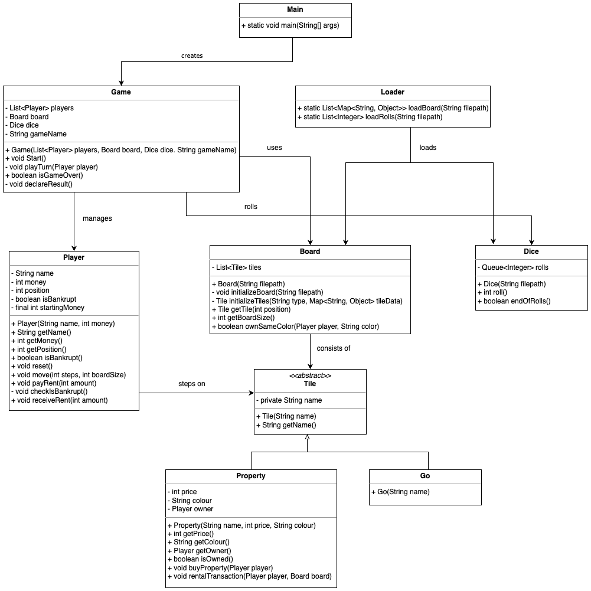
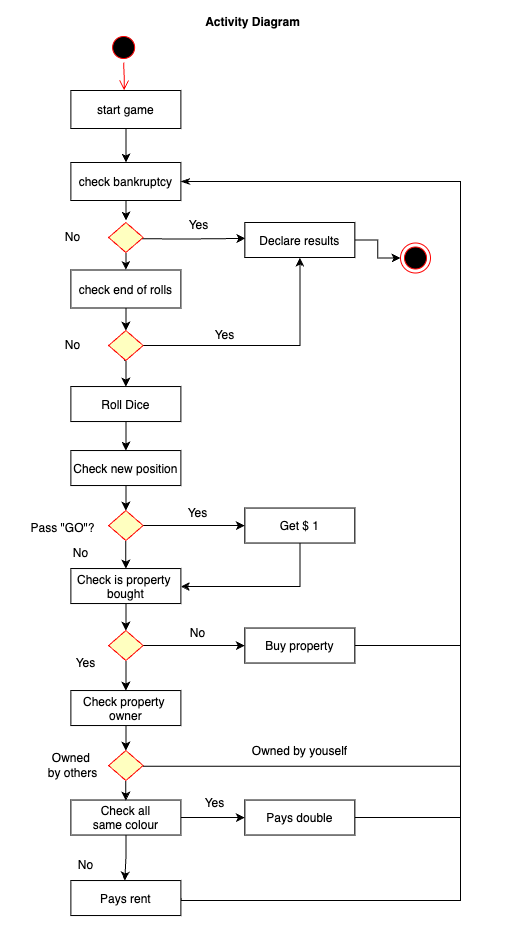

# WovenMonopoly
 
## Project Description:
- This is an mini-game written in Java, which is similar to the game of Monopoly.
- The application depends on the given board.json and rolls_x.json files, feel free to try out other rolls files.

### Game Rules
* There are four players who take turns in the following order:
  * Peter
  * Billy
  * Charlotte
  * Sweedal
* Each player starts with $16
* Everybody starts on GO
* You get $1 when you pass GO (this excludes your starting move)
* If you land on a property, you must buy it
* If you land on an owned property, you must pay rent to the owner
* If the same owner owns all property of the same colour, the rent is doubled
* Once someone is bankrupt, whoever has the most money remaining is the winner
*  * The game ends immediately once someone went bankrupt
* There are no chance cards, jail or stations
* The board wraps around (i.e. you get to the last space, the next space is the first space)

* The final results will tell you 
	* 1. Who would win each game
	* 2. How much money does everybody end up with?
  	* 3. What spaces does everybody finish on?

## Usage:
- Locate the WovenMonopoly file in your directory on terminal, run the .jar file by typing: java -jar WovenMonopoly.jar

## Testing:
- To use other rolls files, change the file name in Main.java when creating the dice, e,g,: Dice dice = new Dice("otherRolls.json");

##Design decisions:
* The codes are written by following the SOLID principles so that the code will be more modular, organized, readable, and extensible.
* Each functions has only a single responsibility so that it will be more clean and reusable.
* I've created the abstract Tile class and have the subclass of Property and GO because it would be easier to create other types e.g. Chance cards, jail, stations more easily without modifying the original class, this allows the extensibility of the game.

## Class Diagram 

## Activity Diagram

